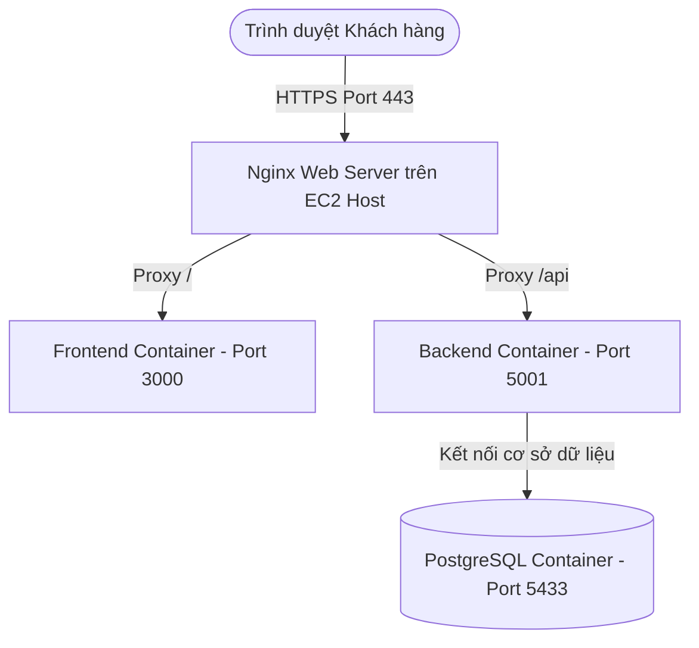

# Hướng Dẫn Triển Khai Hệ Thống TOOR Hotpot Lên Production (AWS & Domain)

Chào bạn! Dưới đây là hướng dẫn chi tiết từng bước (Step-by-step) để đưa toàn bộ dự án **TOOR Hotpot** của bạn lên Internet công cộng sử dụng tài khoản **AWS Academy Learner Lab**, tên miền riêng của bạn, và cài đặt HTTPS bảo mật.

---

## 🗺️ Tổng Quan Kiến Trúc Production

Hệ thống sẽ hoạt động trên một máy chủ **AWS EC2 (Ubuntu 22.04)** chạy **Docker Compose** và **Nginx** làm cổng truy cập duy nhất (Reverse Proxy) giúp bảo mật và tăng hiệu năng:



> [!NOTE]
> **Ưu điểm của mô hình này:**
> 1. Tránh được hoàn toàn lỗi **CORS (Cross-Origin Resource Sharing)** và **Mixed Content (HTTP/HTTPS)** vì cả Front-end và Back-end đều chạy dưới cùng 1 tên miền chính thông qua Nginx.
> 2. Chỉ cần cấp phát 1 chứng chỉ SSL duy nhất cho tên miền.
> 3. Cơ sở dữ liệu PostgreSQL (Port 5433) được che giấu an toàn đằng sau tường lửa, không mở ra ngoài Internet.

---

## 📋 Mục Lục Các Bước Thực Hiện
1. [Bước 1: Khởi tạo EC2 Instance trên AWS Learner Lab](#1-khởi-tạo-ec2-instance)
2. [Bước 2: Cấp phát và Gắn Elastic IP (IP Tĩnh)](#2-cấp-phát-và-gắn-elastic-ip)
3. [Bước 3: Cấu hình DNS Tên Miền (Domain DNS Setup)](#3-cấu-hình-dns-tên-miền)
4. [Bước 4: Cấu hình Swap Memory (Mẹo Quan Trọng Cho Lab)](#4-cấu-hình-swap-memory)
5. [Bước 5: Cài đặt Docker & Docker Compose trên EC2](#5-cài-đặt-docker--docker-compose)
6. [Bước 6: Đồng bộ Code & Cấu hình Biến Môi Trường Production](#6-đồng-bộ-code--cấu-hình-biến-môi-trường)
7. [Bước 7: Chạy Docker Compose & Khởi tạo DB](#7-chạy-docker-compose--khởi-tạo-db)
8. [Bước 8: Cấu hình Nginx & Cấp chứng chỉ SSL (HTTPS) miễn phí](#8-cấu-hình-nginx--cấp-chứng-chỉ-ssl)

---

## 🛠️ Chi Tiết Từng Bước Thực Hiện

### 1. Khởi Tạo EC2 Instance

Vì bạn sử dụng tài khoản **AWS Academy Learner Lab** (vốn có giới hạn quyền và tài nguyên), hãy làm theo các cấu hình chuẩn sau:

1. Đăng nhập vào AWS Console từ Vocareum.
2. Tìm kiếm dịch vụ **EC2** -> Click **Launch Instance**.
3. Cấu hình các thông số:
   * **Name:** `TOOR-Hotpot-Server`
   * **Application and OS Images:** Chọn **Ubuntu** (bản **Ubuntu Server 22.04 LTS**).
   * **Instance Type:** Chọn **t3.micro** (hoặc `t2.micro` tùy thuộc loại máy chủ được Lab cho phép miễn phí. *Lưu ý: các dòng micro này chỉ có 1GB RAM, chúng ta sẽ cần bật thêm Swap ở Bước 4 để tránh bị treo máy khi build Docker*).
   * **Key Pair:** Chọn tạo mới hoặc dùng Key Pair có sẵn của bạn. Hãy tải file `.pem` về máy tính của bạn (ví dụ: `toor-key.pem`).
   * **Network Settings (Security Group):** Tạo mới một Security Group và **tích chọn** cho phép các lưu lượng sau:
     * `Allow SSH traffic from AnyWhere` (Port 22)
     * `Allow HTTPS traffic from the internet` (Port 443)
     * `Allow HTTP traffic from the internet` (Port 80)
4. Click **Launch Instance** để khởi tạo.

---

### 2. Cấp Phát Và Gắn Elastic IP

Mặc định, mỗi khi bạn dừng (Stop) và khởi động lại (Start) EC2 instance trong AWS Lab, địa chỉ IP Public của máy chủ sẽ bị thay đổi. Điều này sẽ làm hỏng cấu hình tên miền của bạn. Hãy giải quyết bằng cách gán **Elastic IP**:

1. Tại thanh menu bên trái EC2 Console, tìm phần **Network & Security** -> Chọn **Elastic IPs**.
2. Click **Allocate Elastic IP address** -> click tiếp **Allocate**.
3. Chọn Elastic IP vừa tạo -> Vào menu **Actions** -> Chọn **Associate Elastic IP address**.
4. Chọn:
   * **Instance:** Máy chủ `TOOR-Hotpot-Server` vừa tạo ở Bước 1.
   * **Private IP address:** Chọn địa chỉ IP tương ứng xuất hiện trong danh sách.
5. Click **Associate**.
6. **Lưu lại địa chỉ Elastic IP mới này** (Ví dụ: `54.210.12.34`).

---

### 3. Cấu Hình DNS Tên Miền

Truy cập trang quản trị nhà đăng ký tên miền của bạn (Cloudflare, Namecheap, GoDaddy, Mắt Bão, Pavietnam, v.v.) và thêm/sửa **2 bản ghi A** như sau:

| Loại (Type) | Tên (Name/Host) | Giá trị (Value/Points to) | TTL |
| :--- | :--- | :--- | :--- |
| **A** | `@` (hoặc để trống) | `Địa_chỉ_Elastic_IP_ở_Bước_2` | Auto / 1 hour |
| **A** | `www` | `Địa_chỉ_Elastic_IP_ở_Bước_2` | Auto / 1 hour |

> [!TIP]
> Hãy kiên nhẫn đợi từ 2 đến 15 phút để tên miền cập nhật IP mới toàn cầu. Bạn có thể kiểm tra bằng cách mở terminal máy tính gõ `ping tenmien.com` xem đã nhận đúng IP chưa.

---

### 4. Cấu Hinh Swap Memory (Mẹo Sống Còn)

Máy chủ dòng Micro chỉ có **1GB RAM**. Khi Docker build ứng dụng React (Vite) ở Front-end, bộ cài NodeJS sẽ ngốn rất nhiều RAM dẫn đến tràn bộ nhớ (Out of Memory - OOM) và làm đơ luôn máy chủ AWS của bạn. Việc tạo thêm bộ nhớ ảo **Swap (2GB)** là bắt buộc:

1. Kết nối SSH vào máy chủ của bạn thông qua Terminal/Powershell (hoặc Git Bash):
   ```bash
   ssh -i "toor-key.pem" ubuntu@<Địa_chỉ_Elastic_IP>
   ```
2. Thực thi tuần tự các lệnh sau để tạo phân vùng Swap dung lượng 2GB:
   ```bash
   # Tạo file Swap
   sudo fallocate -l 2G /swapfile
   
   # Phân quyền bảo mật cho file
   sudo chmod 600 /swapfile
   
   # Định dạng file thành Swap
   sudo mkswap /swapfile
   
   # Kích hoạt Swap
   sudo swapon /swapfile
   
   # Đảm bảo Swap tự động kích hoạt khi restart máy chủ
   echo '/swapfile none swap sw 0 0' | sudo tee -a /etc/fstab
   
   # Kiểm tra xem Swap đã hoạt động chưa
   free -h
   ```
   *(Bạn sẽ thấy dòng `Swap:` hiển thị dung lượng khoảng `2.0Gi`)*.

---

### 5. Cài Đặt Docker & Docker Compose Trên EC2

Khi vẫn đang trong terminal SSH của EC2, hãy cài đặt Docker và Docker Compose phiên bản mới nhất:

```bash
# Cập nhật danh sách gói phần mềm
sudo apt update -y && sudo apt upgrade -y

# Cài đặt các gói phụ trợ cần thiết
sudo apt install -y apt-transport-https ca-certificates curl software-properties-common gnupg lsb-release

# Thêm khóa GPG chính thức của Docker
sudo mkdir -p /etc/apt/keyrings
curl -fsSL https://download.docker.com/linux/ubuntu/gpg | sudo gpg --dearmor -o /etc/apt/keyrings/docker.gpg

# Cấu hình Repository cho Docker
echo \
  "deb [arch=$(dpkg --print-architecture) signed-by=/etc/apt/keyrings/docker.gpg] https://download.docker.com/linux/ubuntu \
  $(lsb_release -cs) stable" | sudo tee /etc/apt/sources.list.d/docker.list > /dev/null

# Cập nhật và cài đặt Docker Engine + Docker Compose Plugin
sudo apt update -y
sudo apt install -y docker-ce docker-ce-cli containerd.io docker-compose-plugin

# Khởi động dịch vụ Docker và thiết lập tự khởi chạy cùng OS
sudo systemctl enable docker
sudo systemctl start docker

# Cấp quyền chạy Docker không cần gõ 'sudo' (cần logout rồi login lại để có hiệu lực)
sudo usermod -aG docker $USER
```

*Hãy thoát ra và kết nối lại SSH để quyền Docker mới có hiệu lực:*
```bash
exit
ssh -i "toor-key.pem" ubuntu@<Địa_chỉ_Elastic_IP>
```

---

### 6. Đồng Bộ Code & Cấu Hình Biến Môi Trường Production

#### Cách 1: Sử dụng Git (Khuyên dùng)
Nếu code của bạn đã được đưa lên GitHub/GitLab:
```bash
# Clone dự án từ git
git clone https://github.com/username/TOOR_Hotpot.git
cd TOOR_Hotpot
```

#### Cách 2: Upload trực tiếp từ máy cá nhân lên EC2 bằng SFTP
Bạn có thể dùng phần mềm như **MobaXterm** hoặc **FileZilla** kết nối vào EC2 sử dụng file khóa `.pem` để upload thư mục dự án lên thư mục `/home/ubuntu/` của máy chủ.

---

### 📥 Điều Chỉnh Biến Môi Trường Cho Production

Khi code đã nằm trên máy chủ EC2, chúng ta cần thay đổi địa chỉ API gọi từ trình duyệt của khách hàng. Trình duyệt của khách sẽ gọi tới tên miền của bạn thay vì `localhost`.

1. Di chuyển vào thư mục dự án trên EC2:
   ```bash
   cd ~/TOOR_Hotpot
   ```
2. Mở file `docker-compose.yml` để chỉnh sửa (sử dụng trình soạn thảo `nano` tích hợp sẵn trong Linux):
   ```bash
   nano docker-compose.yml
   ```
3. Di chuyển con trỏ xuống phần dịch vụ `web:` (frontend) tìm dòng `VITE_API_URL` và sửa lại thành tên miền chính thức của bạn (sử dụng HTTPS):
   ```yaml
   web:
     build:
       context: ./FE
       dockerfile: Dockerfile
     restart: unless-stopped
     environment:
       - VITE_API_URL=https://tenmien.com/api    # <--- SỬA DÒNG NÀY (Thay tenmien.com bằng tên miền của bạn)
     ports:
       - '3000:3000'
     depends_on:
       - api
   ```
4. Nhấn tổ hợp phím `Ctrl + O` -> `Enter` để Lưu, và `Ctrl + X` để Thoát khỏi nano.

5. Tạo file `.env` cho Backend từ file mẫu:
   ```bash
   cp BE/.env.example BE/.env
   ```
   *(File `.env` mặc định kết nối với DB container `db` qua user/pass `postgres/postgres`. Bạn có thể giữ nguyên vì DB này chỉ chạy nội bộ giữa các container).*

---

### 7. Chạy Docker Compose & Khởi Tạo DB

Chạy các Container ở chế độ chạy ngầm (Detached mode) và build lại các Docker Images:

```bash
docker compose up -d --build
```

> [!IMPORTANT]
> **Quá trình khởi tạo cơ sở dữ liệu:**
> Trong file `docker-compose.yml`, container `db` được gắn volume `./BE/src/data/init.sql:/docker-entrypoint-initdb.d/init.sql:ro`. Khi container Postgres chạy lần đầu tiên, nó sẽ tự động chạy file `init.sql` này để tạo bảng và nạp dữ liệu ban đầu cho bạn một cách tự động!

Kiểm tra xem các container đã hoạt động ổn định chưa:
```bash
docker compose ps
```
Bạn sẽ thấy 3 dịch vụ: `db` (chạy trên port 5433), `api` (chạy trên port 5001), và `web` (chạy trên port 3000) đều ở trạng thái `Up`.

---

### 8. Cấu Hình Nginx & Cấp Chứng Chỉ SSL (HTTPS) Miễn Phí

Hiện tại, Web đang chạy ở cổng `3000` và API chạy ở cổng `5001`. Chúng ta sẽ cài đặt Nginx trên máy chủ EC2 để làm đại diện hứng toàn bộ traffic cổng `80` (HTTP) và `443` (HTTPS) từ Internet rồi định tuyến thông minh vào các container tương ứng.

#### 1. Cài đặt Nginx và Certbot (Let's Encrypt)
```bash
sudo apt install -y nginx certbot python3-certbot-nginx
```

#### 2. Cấu hình Nginx
Xóa cấu hình mặc định cũ của Nginx và tạo một cấu hình mới dành riêng cho dự án TOOR Hotpot:
```bash
# Xóa cấu hình mặc định
sudo rm /etc/nginx/sites-enabled/default

# Tạo file cấu hình mới cho web
sudo nano /etc/nginx/sites-available/toor_hotpot
```

Sao chép nội dung cấu hình dưới đây và dán vào cửa sổ Nano (hãy thay thế `tenmien.com` và `www.tenmien.com` bằng tên miền thật của bạn):

```nginx
server {
    listen 80;
    server_name tenmien.com www.tenmien.com; # <--- Thay thế bằng tên miền của bạn

    # Cấu hình chuyển hướng nội bộ cho Frontend
    location / {
        proxy_pass http://localhost:3000;
        proxy_http_version 1.1;
        proxy_set_header Upgrade $http_upgrade;
        proxy_set_header Connection 'upgrade';
        proxy_set_header Host $host;
        proxy_cache_bypass $http_upgrade;
    }

    # Cấu hình chuyển hướng nội bộ cho Backend API
    location /api {
        proxy_pass http://localhost:5001; # Trỏ vào API container
        proxy_http_version 1.1;
        proxy_set_header Upgrade $http_upgrade;
        proxy_set_header Connection 'upgrade';
        proxy_set_header Host $host;
        proxy_cache_bypass $http_upgrade;
        
        # Thiết lập header truyền IP thật của client vào Backend
        proxy_set_header X-Real-IP $remote_addr;
        proxy_set_header X-Forwarded-For $proxy_add_x_forwarded_for;
        proxy_set_header X-Forwarded-Proto $scheme;
    }
}
```
Nhấn tổ hợp phím `Ctrl + O` -> `Enter` để Lưu, và `Ctrl + X` để Thoát.

#### 3. Kích hoạt cấu hình và khởi động lại Nginx
```bash
# Tạo liên kết tượng trưng (Symlink) để kích hoạt website
sudo ln -s /etc/nginx/sites-available/toor_hotpot /etc/nginx/sites-enabled/

# Kiểm tra cú pháp cấu hình Nginx xem có lỗi gì không
sudo nginx -t
```
*(Nếu hiển thị `syntax is ok` và `test is successful`, cấu hình của bạn hoàn toàn chính xác!)*

Khởi động lại dịch vụ Nginx để áp dụng cấu hình:
```bash
sudo systemctl restart nginx
```

#### 4. Cấp chứng chỉ bảo mật SSL HTTPS tự động với Certbot
Chạy câu lệnh đơn giản sau để Certbot tự động cấu hình chứng chỉ Let's Encrypt và tự chèn các dòng mã SSL cấu hình vào Nginx giúp bạn:
```bash
sudo certbot --nginx -d tenmien.com -d www.tenmien.com
```
* **Lưu ý:** Certbot sẽ yêu cầu bạn nhập địa chỉ Email để nhận thông báo gia hạn, sau đó chọn Đồng ý với điều khoản (nhấn `A`), và có chia sẻ email không (nhấn `Y` hoặc `N`).
* Certbot sẽ tự thực hiện xác thực tên miền qua bản ghi DNS và sinh chứng chỉ HTTPS.

Khi thành công, Certbot sẽ báo hoàn thành và tự cấu hình chuyển hướng tự động (Redirect) toàn bộ truy cập từ `http://` sang `https://` siêu bảo mật!

---

## 🎉 Hoàn Thành! Kiểm Tra Thành Quả

Bây giờ bạn có thể mở trình duyệt trên máy tính và truy cập vào tên miền của mình:
* 🌐 **Website chính:** `https://tenmien.com`
* ⚡ **Kiểm tra API Backend:** `https://tenmien.com/api/menu` (sẽ trả về dữ liệu danh sách món ăn dạng JSON từ cơ sở dữ liệu PostgreSQL).

---

## ⚠️ Những Lưu Ý Quan Trọng Khi Sử Dụng AWS Academy Learner Lab

> [!WARNING]
> 1. **Lab Auto-Stop:** Trình quản lý AWS Academy Learner Lab có cơ chế tự động dừng (Stop) các EC2 instance nếu bạn không sử dụng console hoặc vượt quá thời gian phiên làm việc (thường sau 4 tiếng). Nếu thấy web đột ngột không vào được, hãy đăng nhập vào AWS Academy Learner Lab và bấm **Start** lại EC2 instance đó. (Vì chúng ta đã cấu hình **Elastic IP** nên địa chỉ IP và tên miền sẽ không bị đổi!).
> 2. **Tự Động Gia Hạn SSL:** Chứng chỉ SSL Let's Encrypt được cấp miễn phí thời hạn 90 ngày. Hệ thống Ubuntu đã cấu hình sẵn cronjob tự động gia hạn. Bạn có thể kiểm tra tính năng gia hạn tự động bằng lệnh:
>    ```bash
>    sudo certbot renew --dry-run
>    ```

Chúc bạn triển khai dự án TOOR Hotpot thành công rực rỡ! Nếu gặp bất kỳ khó khăn hay lỗi nào trong quá trình thao tác từng bước trên, hãy nhắn mình ngay để cùng xử lý nhé! 🚀
